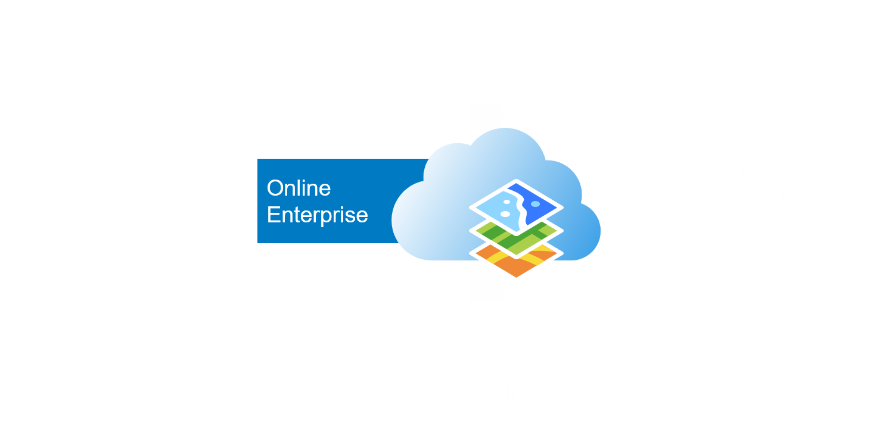
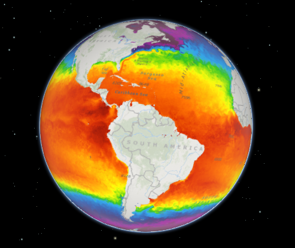

<!-- .slide: data-background="../images/bg-1.png" -->

## Building 3D Apps  with ArcGIS API for JavaScript

<!--
Gianluca Miele - Javier Gutierrez
-->

 
  Javier Gutierrez, Esri R&amp;D Center Z&uuml;rich 
  Gianluca Miele, Esri R&amp;D Center Z&uuml;rich

[Live version of this presentation - https://gmiele.github.io/UC-2019/building-3d-apps-with-arcgis-js-api](https://gmiele.github.io/UC-2019/building-3d-apps-with-arcgis-js-api)

---

## Preface

- This session is about the fundamentals of 3D in the Web 
using the ArcGIS API for JavaScript
- And about writing JavaScript & HTML!

<!-- Esri provides configurable applications
  - [SceneViewer](https://www.esri.com/en-us/arcgis/products/3d-scene-viewer)
  - [Story Maps](https://storymaps.arcgis.com/en/)
  - [Web AppBuilder](https://www.esri.com/en-us/arcgis/products/web-appbuilder/overview)
-->

---

### <b> 3D GIS across industries</b>

<!--
 

<iframe id="scene-view-map-view" data-src="https://www.arcgis.com/home/webscene/viewer.html?webscene=c5b58fa63714412eb0eea933a130ebdf&ui=min" align=left></iframe>

<iframe id="scene-view-map-view" data-src="https://www.arcgis.com/home/webscene/viewer.html?webscene=43e1b988e55a44fdad6c5cf58c34dbda&ui=min"></iframe>

-->

---

<!-- .slide: data-background="../images/bg-1.png" -->
### <b>Agenda</b>
- 3D Platform | Data | API | WebScene
- Create a basic 3D app
- Core concepts of the API
- Working with the API
- Feature highlights & Demos

 

---

### The ArcGIS 3D Platform

---

### Out-of-the-box 3D Web Apps

---

### Building Apps with the ArcGIS 3D Platform

---

### Custom 3D Web Apps

---

### ArcGIS API for JavaScript

https://js.arcgis.com
 

---

### <b>ArcGIS API for JavaScript</b>

- Visual mapping (2D & 3D), components and widgets
- Support for various different layer types (data sources)
- Integration with the ArcGIS platform
 (security, sign-in, premium services, …)

 

<b>Get it today</b> 
Find doc & samples to get started at https://developers.arcgis.com/javascript

---

### Desktop 3D Requirements

 

- Modern hardware, especially Graphics Card

- Latest web browsers with WebGL support
  - Chrome
  - Firefox
  - Safari
  - Edge / Internet Explorer 11\* (\*WebGL not optimized)

---

### Mobile 3D Requirements

 

- Mobile support introduced last year!
- Officially supported for the following devices
  - iOS — iPhone 8/XS, iPad Pro (Safari)
  - Android — Samsung S8/S9/S10, Tab S3/S4 (Chrome)
 

*Other devices/browser may work, but only at your own risk* :)

---

## Data considerations

- 2D data
  - Features
  - Maps
  - Tiles (raster, vector)
  - Elevation

- 3D data as Feature layers

- 3D data as Scene layers (open i3s format)
  - 3D Objects
  - Integrated Meshes
  - Point Clouds
  - Points (from point features)
  - Building Scene Layer

---

### Content for your apps

---

### <b>Publish a layer in ArcGIS Pro</b>

---

### <b>Publish a web scene in ArcGIS Pro</b>

---

### <b>Coordinate System Support for Scenes</b>

- Each scene has its coordinate system defined.
- Cached data needs to be provided in the defined system.
- Feature and dynamic data is projected on the fly.
- Coordinate systems define the type of scenes and its capabilities.

---

### <b>Global scenes</b>

Visualize data on a full globe

---

### <b>Global scenes</b>

Choose one of two geographic coordinate systems
  - WebMercator (wkid: 3857) - ideal to use Esri provided cached data
  - WGS84 (wkid: 4326)
  - CGCS2000 (wkid: 4490) *- China Geodetic coordiante System 2000*

---

### <b>Local scenes</b>

Visualize data in a local planar way
  

---

### <b>Local scenes</b>

Choose one of the following options
- WebMercator (wkid: 3857)
- any projected coordinate system

Clip to your area of interest

---

### <b>Web Scenes Concept</b>

- Vehicle for cross platform 3D capabilities
  - Collection of layers, environment settings, slides
  - Defines the content of a 3D scene
- Stored in ArcGIS Online or Enterprise as `portal-item`
  - Read and write Web Scenes across the ArcGIS platform 
(ArcGIS Pro, Web Apps, ArcGIS Runtime)
  - Serialized as JSON

---

<!-- .slide: data-background="../images/bg-2.png" -->

### Web scene specification

 
https://developers.arcgis.com/web-scene-specification

---

<!-- .slide: data-background="../images/bg-4.png" -->

### ArcGIS Online: 3D Web Scenes
Thursday, 1:00 pm - 2:00 pm 
SDCC - Room 15 B

---

<!-- .slide: data-background="../images/bg-4.png" -->

## <b>Create a 3D App</b>

 

<!--
with the ArcGIS API for JavaScript
-->

---

<!-- .slide: data-background="../images/bg-4.png" -->

### Steps

1. Create basic HTML
2. Load API
3. Add Web Scene
4. Go!

---

## Creating basic HTML

    <pre><code style="margin-bottom: -30px;" class="lang-html">
    &lt;!DOCTYPE html&gt;
    &lt;html&gt;
    &lt;head&gt;
      &lt;meta charset=&quot;utf-8&quot;&gt;
    </code>
    <code style="margin-bottom: -30px;" class="grey">
      &lt;link rel=&quot;stylesheet&quot; href=&quot;//js.arcgis.com/4.12/esri/css/main.css&quot;&gt;
      &lt;script src=&quot;//js.arcgis.com/4.12/&quot;&gt;&lt;/script&gt;
    </code>
    <code style="margin-bottom: -30px;" class="lang-html">
      &lt;title&gt;My first 3D web app&lt;/title&gt;
    &lt;/head&gt;
    &lt;body&gt;
      &lt;script&gt;
    </code>
    <code style="margin-bottom: -30px;" class="grey">
        require([
          "esri/WebScene",
          "esri/views/SceneView",
          "dojo/domReady!"
        ], function(WebScene, SceneView) {
          var scene = new WebScene({
            portalItem: {
              id: "69af87076d884670995217536d60f150"
            }
          });
          var view = new SceneView({
            container: "viewDiv",
            map: scene
          });
        });
    </code>
    <code class="lang-html">
      &lt;/script&gt;
      &lt;div id=&quot;viewDiv&quot;&gt;&lt;/div&gt;
    &lt;/body&gt;
    &lt;/html&gt;
    </code></pre>

---

## Load API

    <pre><code style="margin-bottom: -30px;" class="grey">
    &lt;!DOCTYPE html&gt;
    &lt;html&gt;
    &lt;head&gt;
      &lt;meta charset=&quot;utf-8&quot;&gt;
    </code>
    <code style="margin-bottom: -30px;" class="lang-html">
      &lt;link rel=&quot;stylesheet&quot; href=&quot;//js.arcgis.com/4.12/esri/css/main.css&quot;&gt;
      &lt;script src=&quot;//js.arcgis.com/4.12/&quot;&gt;&lt;/script&gt;
    </code>
    <code style="margin-bottom: -30px;" class="grey">
      &lt;title&gt;My first 3D web app&lt;/title&gt;
    &lt;/head&gt;
    &lt;body&gt;
      &lt;script&gt;
    </code>
    <code style="margin-bottom: -30px;" class="grey">
        require([
          "esri/WebScene",
          "esri/views/SceneView",
          "dojo/domReady!"
        ], function(WebScene, SceneView) {
          var scene = new WebScene({
            portalItem: {
              id: "69af87076d884670995217536d60f150"
            }
          });
          var view = new SceneView({
            container: "viewDiv",
            map: scene
          });
        });
    </code>
    <code class="grey">
      &lt;/script&gt;
      &lt;div id=&quot;viewDiv&quot;&gt;&lt;/div&gt;
    &lt;/body&gt;
    &lt;/html&gt;
    </code></pre>
    

---

## Load modules...

    <pre><code style="margin-bottom: -30px;" class="grey">
    &lt;!DOCTYPE html&gt;
    &lt;html&gt;
    &lt;head&gt;
      &lt;meta charset=&quot;utf-8&quot;&gt;
    </code>
    <code style="margin-bottom: -30px;" class="grey">
      &lt;link rel=&quot;stylesheet&quot; href=&quot;//js.arcgis.com/4.12/esri/css/main.css&quot;&gt;
      &lt;script src=&quot;//js.arcgis.com/4.12/&quot;&gt;&lt;/script&gt;
    </code>
    <code style="margin-bottom: -30px;" class="grey">
      &lt;title&gt;My first 3D web app&lt;/title&gt;
    &lt;/head&gt;
    &lt;body&gt;
      &lt;script&gt;
    </code>
    <code style="margin-bottom: -30px;" class="lang-js">
        require([
          "esri/WebScene",
          "esri/views/SceneView",
          "dojo/domReady!"
        ], function(WebScene, SceneView) {
    </code>
    <code style="margin-bottom: -30px;" class="grey">
          var scene = new WebScene({
            portalItem: {
              id: "69af87076d884670995217536d60f150"
            }
          });
          var view = new SceneView({
            container: "viewDiv",
            map: scene
          });
    </code>
    <code style="margin-bottom: -30px;" class="lang-js">
        });
    </code>
    <code class="grey">
      &lt;/script&gt;
      &lt;div id=&quot;viewDiv&quot;&gt;&lt;/div&gt;
    &lt;/body&gt;
    &lt;/html&gt;
    </code></pre>
    

---

## ... and the Webscene

    <pre><code style="margin-bottom: -30px;" class="grey">
    &lt;!DOCTYPE html&gt;
    &lt;html&gt;
    &lt;head&gt;
      &lt;meta charset=&quot;utf-8&quot;&gt;
    </code>
    <code style="margin-bottom: -30px;" class="grey">
      &lt;link rel=&quot;stylesheet&quot; href=&quot;//js.arcgis.com/4.12/esri/css/main.css&quot;&gt;
      &lt;script src=&quot;//js.arcgis.com/4.12/&quot;&gt;&lt;/script&gt;
    </code>
    <code style="margin-bottom: -30px;" class="grey">
      &lt;title&gt;My first 3D web app&lt;/title&gt;
    &lt;/head&gt;
    &lt;body&gt;
      &lt;script&gt;
    </code>
    <code style="margin-bottom: -30px;" class="grey">
        require([
          "esri/WebScene",
          "esri/views/SceneView",
          "dojo/domReady!"
        ], function(WebScene, SceneView) {
    </code>
    <code style="margin-bottom: -30px;" class="lang-js">
          var scene = new WebScene({
            portalItem: {
              id: "69af87076d884670995217536d60f150"
            }
          });
    </code>
    <code style="margin-bottom: -30px;" class="grey">
          var view = new SceneView({
            container: "viewDiv",
            map: scene
          });
        });
    </code>
    <code class="grey">
      &lt;/script&gt;
      &lt;div id=&quot;viewDiv&quot;&gt;&lt;/div&gt;
    &lt;/body&gt;
    &lt;/html&gt;
    </code></pre>

  

---

## Create the view

    <pre><code style="margin-bottom: -30px;" class="grey">
    &lt;!DOCTYPE html&gt;
    &lt;html&gt;
    &lt;head&gt;
      &lt;meta charset=&quot;utf-8&quot;&gt;
    </code>
    <code style="margin-bottom: -30px;" class="grey">
      &lt;link rel=&quot;stylesheet&quot; href=&quot;//js.arcgis.com/4.12/esri/css/main.css&quot;&gt;
      &lt;script src=&quot;//js.arcgis.com/4.12/&quot;&gt;&lt;/script&gt;
    </code>
    <code style="margin-bottom: -30px;" class="grey">
      &lt;title&gt;My first 3D web app&lt;/title&gt;
    &lt;/head&gt;
    &lt;body&gt;
      &lt;script&gt;
    </code>
    <code style="margin-bottom: -30px;" class="grey">
        require([
          "esri/WebScene",
          "esri/views/SceneView",
          "dojo/domReady!"
        ], function(WebScene, SceneView) {
    </code>
    <code style="margin-bottom: -30px;" class="grey">
          var scene = new WebScene({
            portalItem: {
              id: "69af87076d884670995217536d60f150"
            }
          });
    </code>
    <code style="margin-bottom: -30px;" class="lang-js">
          var view = new SceneView({
            container: "viewDiv",
            map: scene
          });
    </code>
    <code class="grey">
        });
      &lt;/script&gt;
      &lt;div id=&quot;viewDiv&quot;&gt;&lt;/div&gt;
    &lt;/body&gt;
    &lt;/html&gt;
    </code></pre>
    

---

## Your 3D app is ready to go

  

    <pre><code style="margin-bottom: -30px;" class="lang-html">
    &lt;!DOCTYPE html&gt;
    &lt;html&gt;
    &lt;head&gt;
      &lt;meta charset=&quot;utf-8&quot;&gt;
    </code>
    <code style="margin-bottom: -30px;" class="lang-html">
      &lt;link rel=&quot;stylesheet&quot; href=&quot;//js.arcgis.com/4.12/esri/css/main.css&quot;&gt;
      &lt;script src=&quot;//js.arcgis.com/4.12/&quot;&gt;&lt;/script&gt;
    </code>
    <code style="margin-bottom: -30px;" class="lang-html">
      &lt;title&gt;My first 3D web app&lt;/title&gt;
    &lt;/head&gt;
    &lt;body&gt;
      &lt;script&gt;
    </code>
    <code style="margin-bottom: -30px;" class="lang-js">
        require([
          "esri/WebScene",
          "esri/views/SceneView",
          "dojo/domReady!"
        ], function(WebScene, SceneView) {
          var scene = new WebScene({
            portalItem: {
              id: "69af87076d884670995217536d60f150"
            }
          });
          var view = new SceneView({
            container: "viewDiv",
            map: scene
          });
        });
    </code>
    <code class="lang-html">
      &lt;/script&gt;
      &lt;div id=&quot;viewDiv&quot;&gt;&lt;/div&gt;
    &lt;/body&gt;
    &lt;/html&gt;
    </code></pre>
    

  

  

    <iframe id="scene-view-map-view" data-src="./snippets/setup-snippet-1.html" ></iframe>
  

---

<!-- .slide: data-background="../images/bg-4.png" -->

## <b>Core concepts of the API</b>

---

## Details about the `Webscene` class

- `Layers`, `Presentation`, ...
- `Basemap` is exactly the same concept as in 2D
- `Ground` defines the ground surface of the scene

---

## Layers

|              |  |
|--------------|--|
| `FeatureLayer` | <small>2D & 3D</small> |
| `CSVLayer` | <small>2D & 3D</small> |
| `StreamLayer` | <small>2D & 3D</small> |
| `MapImageLayer` | <small>2D & 3D</small> |
| `ImageryLayer` | <small>2D & 3D</small> |
| `WMSLayer` | <small>2D & 3D</small> |
| `OpenStreetMapLayer` | <small>2D & 3D</small> |
| `TileLayer` | <small>2D & 3D</small> |
| `WebTileLayer` | <small>2D & 3D</small> |
| `WMTSLayer` | <small>2D & 3D</small> |
| `VectorTileLayer` | <small>2D & 3D</small> |
| `ElevationLayer` | <small> 3D only</small> |
| `SceneLayer` | <small> 3D only</small> |
| `IntegratedMeshLayer` | <small> 3D only</small> |
| `PointCloudLayer` | <small> 3D only</small> |
| `BuildingSceneLayer` | <small> 3D only</small> |

---

## Layers

|              |  |
|--------------|--|
| 
`FeatureLayer`
 | <small>2D & 3D</small> |
| `CSVLayer` | <small>2D & 3D</small> |
| `StreamLayer` | <small>2D & 3D</small> |
| `MapImageLayer` | <small>2D & 3D</small> |
| `ImageryLayer` | <small>2D & 3D</small> |
| `WMSLayer` | <small>2D & 3D</small> |
| `OpenStreetMapLayer` | <small>2D & 3D</small> |
| `TileLayer` | <small>2D & 3D</small> |
| `WebTileLayer` | <small>2D & 3D</small> |
| `WMTSLayer` | <small>2D & 3D</small> |
| `VectorTileLayer` | <small>2D & 3D</small> |
| `ElevationLayer` | <small> 3D only</small> |
| `SceneLayer` | <small> 3D only</small> |
| `IntegratedMeshLayer` | <small> 3D only</small> |
| `PointCloudLayer` | <small> 3D only</small> |

---

## Adding a `FeatureLayer`

    <pre><code style="margin-bottom: -40px;" class="grey">
        require([
          "esri/WebScene",
          "esri/views/SceneView",
    </code>
    <code style="margin-bottom: -40px;" class="lang-js">
          "esri/layers/FeatureLayer",
    </code>
    <code style="margin-bottom: -40px;" class="grey">
          "dojo/domReady!"
    </code>
    <code style="margin-bottom: -40px;" class="lang-js">
        ], function(WebScene, SceneView, FeatureLayer) {
    </code>
    <code style="margin-bottom: -40px;" class="grey">
          var scene = new WebScene({
            portalItem: {
              id: "69af87076d884670995217536d60f150"
            }
          });
          var view = new SceneView({
            container: "viewDiv",
            map: scene
          });
    </code>
    <code style="margin-bottom: -40px;" class="lang-js">
          var layer = new FeatureLayer({
            portalItem: {
              id: "a38c0bd41aad41d89ab2a31050ff07b1"
            }
          });
          scene.add(layer);
    </code>
    <code class="grey">
        });
    </code></pre>
    

---

## Adding a layer

  

    <pre><code class="lang-js">
        require([
          "esri/WebScene",
          "esri/views/SceneView",
          "esri/layers/FeatureLayer",
          "dojo/domReady!"
        ], function(WebScene, SceneView, FeatureLayer) {
          var scene = new WebScene({
            portalItem: {
              id: "69af87076d884670995217536d60f150"
            }
          });
          var view = new SceneView({
            container: "viewDiv",
            map: scene
          });
          var layer = new FeatureLayer({
            portalItem: {
              id: "a38c0bd41aad41d89ab2a31050ff07b1"
            }
          });
          scene.add(layer);
        });
    </code></pre>
    

  

  

    <iframe id="scene-view-map-view" data-src="./snippets/setup-snippet-2.html"></iframe>
  

---

## Widgets

Widgets are UI components that add functionalities to your scene. The API provides ready-to-use widgets, for example:

- `Legend`
- `LayerList`
- `Search`
- ...

---

## Adding a widget

    <pre><code style="margin-bottom: -40px;" class="grey">
        require([
          "esri/WebScene",
          "esri/views/SceneView",
          "esri/layers/FeatureLayer",
    </code>
    <code style="margin-bottom: -40px;" class="lang-js">
          "esri/widgets/Search",
    </code>
    <code style="margin-bottom: -40px;" class="grey">
          "dojo/domReady!"
        ], function(
          WebScene, 
          SceneView, 
          FeatureLayer,
    </code>
    <code style="margin-bottom: -40px;" class="lang-js">
          Search
        ) {
    </code>
    <code style="margin-bottom: -40px;" class="grey">

          // ...

    </code>
    <code style="margin-bottom: -40px;" class="lang-js">
          var searchWidget = new Search({
            view: view
          });
          view.ui.add(searchWidget, {
            position: "top-right"
          });
    </code>
    <code class="grey">
        });
    </code></pre>
    

---

## Adding a widget

  

    <pre><code class="lang-js">
        require([
          "esri/WebScene",
          "esri/views/SceneView",
          "esri/layers/FeatureLayer",
          "esri/widgets/Search",
          "dojo/domReady!"
        ], function(
          WebScene, 
          SceneView, 
          FeatureLayer,
          Search
        ) {

          // ...

          var searchWidget = new Search({
            view: view
          });
          view.ui.add(searchWidget, {
            position: "top-right"
          });
        });
    </code></pre>
    

  

  

    <iframe id="scene-view-map-view" data-src="./snippets/setup-snippet-3.html"></iframe>
  

---

## Popups

  

Enable on a layer:

  

    <pre><code class="lang-js" style="margin-bottom: 20px;">
  layer.popupEnabled = true;
</code></pre>

  

Open it programmatically:

      

        <pre><code class="lang-js">
  view.on("click", function(event) {
    event.stopPropagation();
    view.popup.open({
      title: "Reverse geocode: [" 
        + event.mapPoint.longitude 
        + ", " + event.mapPoint.latitude 
        + "]",
      location: event.mapPoint
    });
  });
        </code></pre>
      

  

  

    <iframe id="scene-view-map-view" data-src="./snippets/setup-snippet-3.html"></iframe>
  

---

## Popup templates

  

    Display attribute using the `PopupTemplate`
    

      <pre><code class="lang-js">
  var template = {
    title: "Building <b>{NAME}</b>",
    content: "This build has an enery consumption "
      + "of <b>{ElectricUse}</b> kBTU, for a score "
      + "of <b>{StarScore}</b>."
  };
  layer.popupTemplate = template;
      </code></pre>
    

  

  

    <iframe id="scene-view-map-view" data-src="./snippets/setup-snippet-4.html"></iframe>
  

---

## Architecture
 

---

## Architecture
 

---

## Working with the [SceneView](https://developers.arcgis.com/javascript/latest/api-reference/esri-views-SceneView.html)

  <pre><code class="lang-ts">
class SceneView {
  // Camera specifies the view
  camera: Camera;

  // Animations, framing
  goTo(...);

  // Finding graphics at screen locations
  hitTest(...);

  // Converting coordinate systems
  toScreen(mapPoint: Point): ScreenPoint;
  toMap(screenPoint: ScreenPoint): Point;
}
  </code></pre>

---

## [Camera](https://developers.arcgis.com/javascript/latest/api-reference/esri-Camera.html)

- Primary specification of the view is the [`Camera`](https://developers.arcgis.com/javascript/beta/api-reference/esri-Camera.html)

  <pre><code class="lang-ts">
class Camera {
  // The position of the camera eye in 3D space (x, y + z elevation)
  position: Point;

  // The heading angle (towards north in degrees, [0, 360]°)
  heading: number;

  // The tilt angle ([0, 180]°, with 0° straight down, 90° horizontal)
  tilt: number;
}
  </code></pre>

---

## [Camera](https://developers.arcgis.com/javascript/latest/api-reference/esri-Camera.html)

  

<button class="play" id="scene-view-camera-button01"></button>
<pre><code class="lang-ts">const camera = view.camera.clone();

// Increment the heading of the camera by 5 degrees
camera.heading += 5;

// Set the modified camera on the view
view.camera = camera;</code></pre>

  

  

    <iframe id="camera-demo" data-src="./snippets/concepts-camera.html" ></iframe>
  

---

## [goTo](https://developers.arcgis.com/javascript/latest/api-reference/esri-views-SceneView.html#goTo)

  

<button class="play" id="scene-view-go-to-button01"></button>
<pre><code class="lang-ts">// target heading = current heading + 30
var newHeading = view.camera.heading + 30;

// go to heading preserves view.center
view.goTo({
    heading: newHeading
});</code></pre>

<button class="play" id="scene-view-go-to-button02"></button>
<pre><code class="lang-ts">// coordinates (lon, lat) of Mount Fuji
var newCenter = [138.729050, 35.360638];

view.goTo({
   center: newCenter,
   zoom: 13
});</code></pre>

  

  

    <iframe id="go-to-demo" data-src="./snippets/concepts-goTo.html" ></iframe>
  

---

## [toMap](https://developers.arcgis.com/javascript/latest/api-reference/esri-views-SceneView.html#toMap)

  

<pre><code class="lang-js">// Every time the user clicks on the map...
view.on("click", function(event) {

  // convert the screen position to map coordinates
  var position = view.toMap(event.x, event.y);
  
  // add a cone symbol at that location
  view.graphics.add(new Graphic({
    geometry: position,
    symbol: coneSymbol
  });
});</code></pre>

  

  

    <iframe id="to-map-to-screen-demo" data-src="./snippets/concepts-toMap.html" ></iframe>
  

---

## Working with layers

  <pre><code class="lang-ts">
class SceneLayer {
  // Filtering 
  definitionExpression: string;

  // Renderer assigns each feature a color and style
  renderer: Renderer;

  // Querying
  queryFeatures(params: Query): FeatureSet;
  queryExtent(params: Query): Extent;
  ...
}
  </code></pre>

---

## Filtering

  

<button class="play" id="mesh-filtering-button01"></button>
<pre><code class="lang-js">// only show buildings constructed before 1900
sceneLayer.definitionExpression =
  "CNSTRCT_YR < 1900 AND CNSTRCT_YR > 0";
</code></pre>

<button class="play" id="mesh-filtering-button03"></button>
<pre><code class="lang-js">// reset filter
sceneLayer.definitionExpression = null;
</code></pre>

<button class="play" id="mesh-filtering-button02"></button>
<pre><code class="lang-js">// only show tall buildings
sceneLayer.definitionExpression =
  "HEIGHTROOF > 300";
</code></pre>

  

  

    <iframe id="scene-layer-mesh2" data-src="./snippets/concepts-definitionExpression.html" ></iframe>
  

---

## Setting layer style

  

<button class="play" id="mesh-renderer-button01"></button>
<pre><code class="lang-js">// draw buildings in transparent green
sceneLayer.renderer = {
  type: "simple",
  symbol: {
    type: "mesh-3d",
    symbolLayers: [{
      type: "fill",
      material: {
        color: [144, 238, 144, 0.3]
      }
    }]
  }
};
</code></pre>

<button class="play" id="mesh-renderer-button02"></button>
<pre><code class="lang-js">// color buildings by construction year
sceneLayer.renderer = {
 type: "simple",
 visualVariables: [{
   type: "color",
   field: "CNSTRCT_YR",
   stops: [{
       value: 1867,
       color: [69, 83, 122]
     },
     ...
   ]
 }]
};
</code></pre>

  

  

    <iframe id="scene-layer-mesh2" data-src="./snippets/concepts-renderer.html" ></iframe>
  

---

## [Underground](https://developers.arcgis.com/javascript/latest/api-reference/esri-Ground.html)

  

<button class="play" id="underground-button01"></button>
<pre><code class="lang-js">// Ground object is part of Map/WebScene
var ground = webScene.ground;

// Set ground to 50% transparent
ground.opacity = 0.5;
</code></pre>

<button class="play" id="underground-button02"></button>
<pre><code class="lang-js">// allow camera to go underground
ground.navigationConstraint = {
  type: "none"
};
</code></pre>

  

  

    <iframe id="scene-layer-mesh2" data-src="./snippets/concepts-underground.html" ></iframe>
  

---

<!-- .slide: data-background="../images/bg-4.png" -->
### 3D Visualization with the ArcGIS API for JavaScript 
Wednesday (yesterday), 2:30 pm - 3:30 pm 
SDCC - Room 15 A
  
<small>related session</small>

<!--<h3 class="fragment" data-fragment-index="1">ArcGIS API for JavaScript: Best Practices for Building Apps</h3>
Wednesday, 2:30 pm - 3:30 pm 
Room 31A 

-->

---

<!-- .slide: data-background="../images/bg-1.png" -->

## <b>Feature Highlights & Demos</b> 

- [Client side filters](https://developers.arcgis.com/javascript/latest/sample-code/layers-scenelayerview-query-stats/live/index.html)
- [Participatory Planning](https://github.com/Esri/participatory-planning)
- [Building Viewer](https://github.com/Esri/building-viewer)

---

### Client side filters

<iframe id="scene-view-map-view" data-src="./snippets/scenelayerview-query-stats.html"></iframe>

---

### Participatory Planning
<!--#### Draw and create your next neighborhood-->

<iframe id="scene-view-map-view" data-src="https://esri.github.io/participatory-planning/"></iframe>

---

### Building Viewer
<!--#### Make your BIM data accessible-->

<!---->

<iframe id="scene-view-map-view" data-src="https://zrh-devweb.esri.com/yann9059/bsl-demo-app/"></iframe>

---

### Do more with Buildings [Sample](https://developers.arcgis.com/javascript/latest/sample-code/building-scene-layer-slice/index.html)

<iframe id="scene-view-map-view" data-src="./snippets/bsl-slice-example.html"></iframe>

---

### There is one more...

---

### Water

<iframe id="scene-view-map-view" height=550 data-src="https://arcg.is/1i0far"></iframe>

---

### Please Share Your Feedback using the Esri events App

---

<!--### Thanks for attending-->

